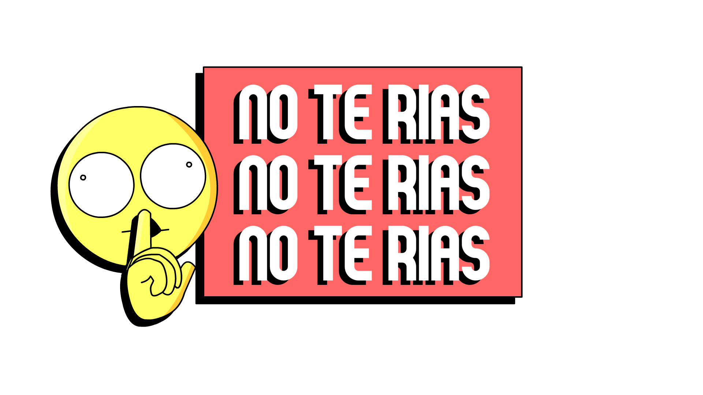

<h1>Don't laugh</h1>
 

<h1>Global Game Jam 2024</h1>
 

### Event: Global Game Jam

## Integrantes y roles

|Members         |Area              |Rol               |
|:------------------|:-----------------|:-----------------|
|Diana Garcia   |*Game Developer:*     |Programing     |
|Sebastian Gonzalez      |*Game Developer:*      |Programing|
|Juan Pablo    |*Artist:*      |Pictures|
|Juan Espitia       |*Game Developer*      |Programing|

This mobile game is a social experience that enables various groups of people to engage and tackle diverse challenges, all under the strict condition of avoiding noise generation.

# Backend Nest.JS

### Start 🚀

This app consists of two parts: an API that fetches jokes and challenges, and another part that involves Unity development for Web, PC, and Android devices.

### Install 🔧

- Clone this repository git clone git@github.com:Regniek/no-te-rindas-api.git
- Install dependencies with npm i
- Create Database
- add .env file
- run server with  npm run start:dev

# App Unity 

### Start 🚀

These services are designed to facilitate the development and construction of the app across various systems 

### Install 🔧

- Clone this repository git clone git@github.com:Regniek/GameJam2024.git
- open in Unity

# Licencia  

Este proyecto está bajo la Licencia (MIT)
